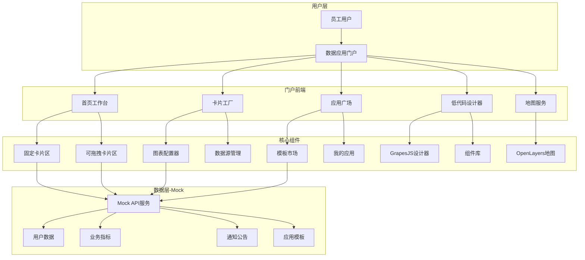
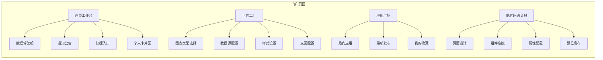
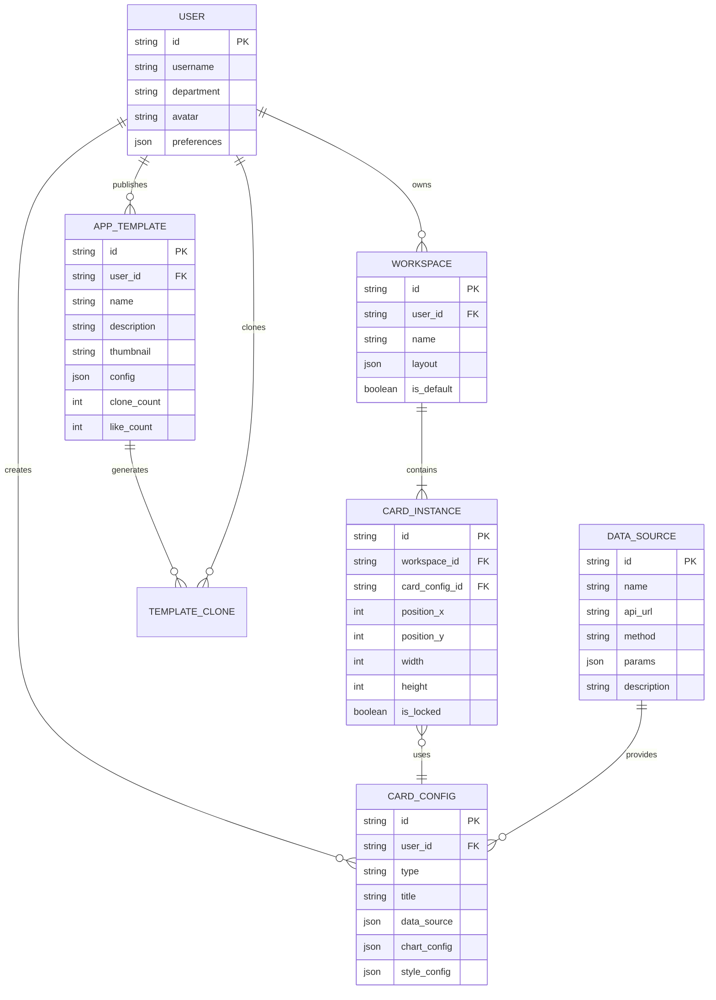

# 数据应用门户网站 - 项目设计文档

## 1. 系统架构

## 2. 页面结构

## 3. 数据模型

## 4. 接口清单

### 4.1 用户模块

| 接口                  | 方法 | 描述             |
| --------------------- | ---- | ---------------- |
| /api/user/info        | GET  | 获取当前用户信息 |
| /api/user/preferences | PUT  | 更新用户偏好设置 |

### 4.2 工作台模块

| 接口                 | 方法 | 描述               |
| -------------------- | ---- | ------------------ |
| /api/workspace/list  | GET  | 获取用户工作台列表 |
| /api/workspace/save  | POST | 保存工作台布局     |
| /api/workspace/cards | GET  | 获取工作台卡片     |

### 4.3 卡片模块

| 接口             | 方法   | 描述             |
| ---------------- | ------ | ---------------- |
| /api/card/types  | GET    | 获取卡片类型列表 |
| /api/card/create | POST   | 创建卡片配置     |
| /api/card/update | PUT    | 更新卡片配置     |
| /api/card/delete | DELETE | 删除卡片         |
| /api/card/data   | POST   | 获取卡片数据     |

### 4.4 数据源模块

| 接口                  | 方法 | 描述           |
| --------------------- | ---- | -------------- |
| /api/datasource/list  | GET  | 获取数据源列表 |
| /api/datasource/test  | POST | 测试数据源连接 |
| /api/datasource/query | POST | 查询数据源数据 |

### 4.5 应用广场模块

| 接口                  | 方法 | 描述         |
| --------------------- | ---- | ------------ |
| /api/template/list    | GET  | 获取模板列表 |
| /api/template/detail  | GET  | 获取模板详情 |
| /api/template/publish | POST | 发布模板     |
| /api/template/clone   | POST | 克隆模板     |
| /api/template/like    | POST | 点赞模板     |

### 4.6 数据驾驶舱模块

| 接口                        | 方法 | 描述            |
| --------------------------- | ---- | --------------- |
| /api/dashboard/kpi          | GET  | 获取核心KPI数据 |
| /api/dashboard/trend        | GET  | 获取趋势数据    |
| /api/dashboard/distribution | GET  | 获取分布数据    |

### 4.7 通知公告模块

| 接口               | 方法 | 描述         |
| ------------------ | ---- | ------------ |
| /api/notice/list   | GET  | 获取通知列表 |
| /api/notice/detail | GET  | 获取通知详情 |

## 5. UI/UX 规范

### 5.1 色彩体系

- 主色调：#1E9FFF (Layui蓝)
- 辅助色：#5FB878 (成功绿)、#FFB800 (警告黄)、#FF5722 (危险红)
- 背景色：#F2F2F2 (页面背景)、#FFFFFF (卡片背景)
- 文字色：#333333 (主文字)、#666666 (次文字)、#999999 (辅助文字)

### 5.2 字体规范

- 主标题：18px, font-weight: 600
- 副标题：16px, font-weight: 500
- 正文：14px, font-weight: 400
- 辅助文字：12px, font-weight: 400

### 5.3 间距规范

- 页面边距：24px
- 卡片间距：16px
- 内容间距：12px
- 元素间距：8px

### 5.4 圆角规范

- 大卡片：8px
- 小卡片/按钮：4px
- 标签：2px

### 5.5 阴影规范

- 卡片阴影：0 2px 12px rgba(0, 0, 0, 0.1)
- 悬浮阴影：0 4px 20px rgba(0, 0, 0, 0.15)
